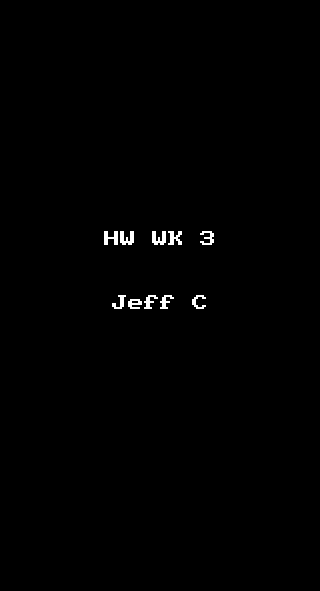

# iOS for Designers Homework Week 3

This is an assignment to implement the Mailbox interactions.

Time spent: 11.3

## Completed user stories:

### On dragging the message left...

 * [x] Required: Initially, the revealed background color should be gray.
 * [x] Required: As the reschedule icon is revealed, it should start semi-transparent and become fully opaque. 
 * [x] Required:If released at this point, the message should return to its initial position.
 * [x] Required: After 60 pts, the later icon should start moving with the translation and the background should change to yellow.
 * [x] Required: Upon release, the message should continue to reveal the yellow background. When the animation it complete, it should show the reschedule options.
 * [x] Required: After 260 pts, the icon should change to the list icon and the background color should change to brown.
 * [x] Required: Upon release, the message should continue to reveal the brown background. When the animation it complete, it should show the list options.
 * [x] Required: User can tap to dismissing the reschedule or list options. After the reschedule or list options are dismissed, you should see the message finish the hide animation.

## On dragging the message right...

 * [x] Required: Initially, the revealed background color should be gray.
 * [x] Required: As the archive icon is revealed, it should start semi-transparent and become fully opaque. If released at this point, the message should return to its initial position.
 * [x] Required: After 60 pts, the archive icon should start moving with the translation and the background should change to green.
 * [x] Required: Upon release, the message should continue to reveal the green background. When the animation it complete, it should hide the message.
 * [x] Required: After 260 pts, the icon should change to the delete icon and the background color should change to red.
 * [x] Required: Upon release, the message should continue to reveal the red background. When the animation it complete, it should hide the message.
 * [x] Optional: Panning from the edge should reveal the menu
 * [x] Optional: If the menu is being revealed when the user lifts their finger, it should continue revealing.
 * [x] Optional: If the menu is being hidden when the user lifts their finger, it should continue hiding.
 * [ ] Optional: Tapping on compose should animate to reveal the compose view.
 * [ ] Optional: Tapping the segmented control in the title should swipe views in from the left or right.
 * [ ] Optional: Shake to undo.

 
Notes:

Walkthrough of all user stories:

GIF created with [LiceCap](http://www.cockos.com/licecap/)